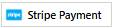

<h2>Hi, I am Sejin Ahmed 👋</h2>
<h3>About Me</h3>
Welcome to my GitHub profile! I'm a passionate web and mobile developer, currently studying in Class 10 at BCIC School and College. I absolutely love coding and building amazing things using modern technologies.
  
Here, you'll find various projects showcasing my skills in web and mobile app development. I'm always experimenting with new tools and technologies, and I'm eager to contribute to exciting open-source projects!
<h2>🚀 Technologies & Tools I Work With</h2>

  
  
  
  
  
  
  
  
  
  
  
  
  
  
  
  
  
  
  
  
  
  
  

<h2>GitHub Stats</h2>

<h2>Most Used Languages</h2>

